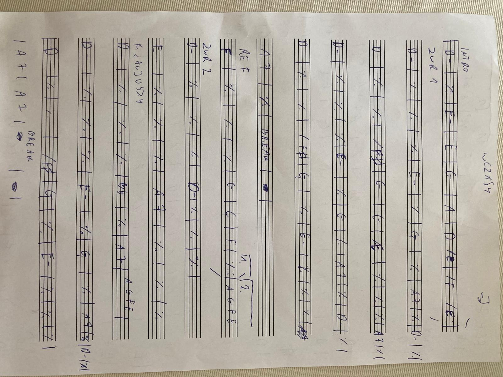
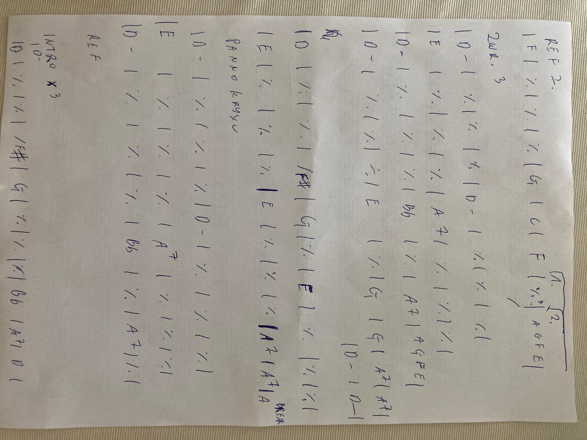

# Jesteśmy na wczasach
[Powrót](index.html) | [Chords](#chords) | [Lyrics](#lyrics) | [Legendary Pete Sheetz](#legendary-pete-sheetz)

| | |
|-|-|
|Title|Jesteśmy na wczasach|
|Artist|Raz dwa trzy|
|Writer|Wojciech Młynarski|
|Time signature|4/4|
|Tempo|216 BPM|
|Key|D- (original)|

### Chords

```text
[Intro]
|: D- | % | E7 | % |
| G- | A7 | D- /E | /(F E) :|x2

[Verse 1]
|: D- | % | % | % |
| E7 | % | G- | % |
| A7 | % | D- | % |
| D | % | % | /F# |
| G- | % | E7 | % |
| E7 | % | A7 | % :|x2
(break) | -- | -- |

[Chorus]
|: F | % | % | % |
| G- | C | F |1 F :|2 A7 /(G F E) |

[Verse 2]
| D- | % | % | % |
| D- | % | % | % |
| E7 | % | % | % |
| Bb | % | A7 | /(A G F E) |

| D- | % | % | % |
| E7 | % | G- | % |
| A7 | % | D- | % |
| D | % | % | /F# |
| G- | % | E7 | % |
| E7 | % | A7 | % |
(break) | -- | -- |

[Chorus]
|: F | % | % | % |
| G- | C | F |1 F :|2 A7 /(G F E) |

[Verse 3]
| D- | % | % | % |
| D- | % | % | % |
| E7 | % | % | % |
| A7 | % | % | % |
| D- | % | % | % |
| Bb | % | A7 | /(A G F E) |

| D- | % | % | % |
| E7 | % | G- | % |
| A7 | % | D- | % |
| D | % | % | /F# |
| G- | % | E7 | % |
| E7 | % | % | % |
| E7 | % | % | % |
| E7 | % | A7 | % |
(Break) Panno Krysiu!

| D- | % | % | % |
| D- | % | % | % |
| E7 | % | % | % |
| A7 | % | % | % |
| D- | % | % | % |
| Bb | % | A7 | /(A G F E) |

[Chorus NO VOC]
| F | % | % | % |
| G- | C | F | % |

[Outro]
|: D- | % | E7 | % |
| G- | A7 | D- /E | /(F E) :|x3

| D | % | G- | % |
| E7b9 (G# B D F) | A7b9 (G Bb C# E) | 
| D- (A C#) | D- ||

```

### Lyrics

```text
[V1] Za oknami noc, w górach śniegu moc okrywa wszystko
czort jedyny wie, co rzuciło mnie w to uzdrowisko.
Na parkiecie szum, wczasowiczów tłum spleciony gęsto,
siedzę tutaj sam, a przed sobą mam orkiestrę męską.
Typ, co szarpie bas wie, że nadszedł czas, gdy w kimś na bańce
czuła struna drgnie i rozpoczną się góralskie tańce.
Jest górala wart taniec, gdy masz fart, gdy dziewczę kwili.
Z basem typ to wie, więc szykuje się i już po chwili:

[C] Jesteśmy na wczasach w tych góralskich lasach,
w promieniach słonecznych opalamy się.
Orkiestra przygrywa skocznego béguine'a,
to nie twoja wina, że podrywam cię...

[V2] Ta panna Krysia, panna Krysia
królowała na turnusach nie od dzisiaj,
a każdego roku właśnie o tej porze
przyjeżdżała tu, do pensjonatu „Orzeł".
Kuracjuszy rozmarzony wzrok
śledził wciąż jej każdy gest i krok.

Za oknami noc, w górach śniegu moc na drzewach wisi,
czort jedyny wie, że basista też się kocha w Krysi...
Wie jedyny czort, co oznacza to, by wciąż od nowa
brać kontrabas i, tłumiąc pożar krwi, tak anonsować:

[C] Jesteśmy na wczasach w tych góralskich lasach,
w promieniach słonecznych opalamy się.
Orkiestra przygrywa skocznego béguine'a,
to nie twoja wina, że podrywam cię...

[V3] A panna Krysia, panna Krysia
z panem Mietkiem, co się tuż przed chwilą przysiadł,
przemierzała wzdłuż i wszerz parkietu przestrzeń,
ale nigdy nie spojrzała ku orkiestrze,
skąd basisty rozmarzony wzrok
śledził wciąż jej każdy gest i krok.

Za oknami noc, w górach śniegu moc okrywa wszystko,
cały turnus śpi, a wśród innych śpi i nasz basista,
na parkiecie szum, wczasowiczów tłum, przy czołach czoła,
a on rzuca bas [pauza...]
i ma w oczach blask [pauza...]
i głośno woła:
"Panno Krysiu... kocham panią!... Wszystko..."

Co to się działo, co się działo!
Uzdrowiska pół ze śmiechu się skręcało
i skręciło by do końca biednych ludzi,
gdyby wreszcie się basista nie obudził...
Bo miewamy często głupie sny,
ale potem się budzimy i...
```

### Legendary Pete Sheetz


