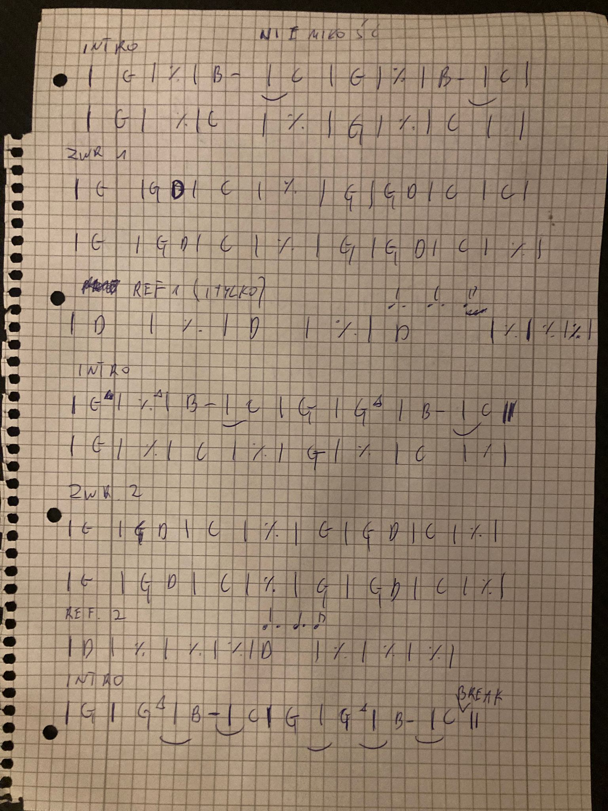
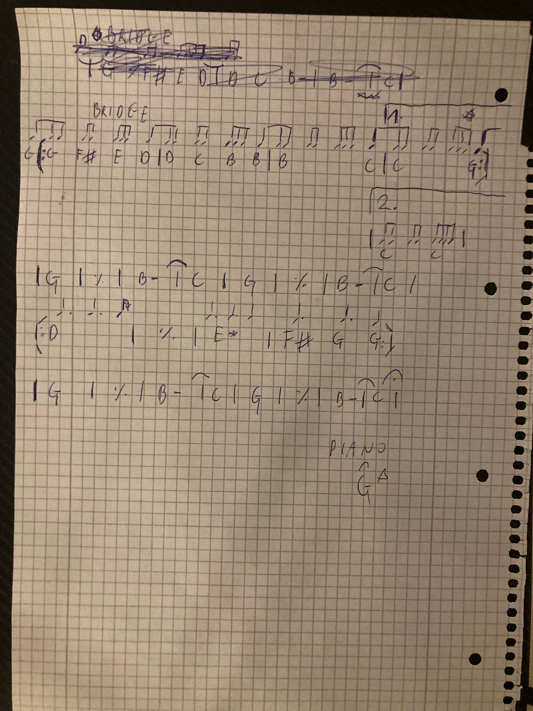

# Niemiłość
[Chords](#chords) | [Lyrics](#lyrics) | [Legendary Pete Sheetz](#legendary-pete-sheetz)

| | |
|-|-|
| Title | Niemiłość |
| Artist | Organek |
| Time signature | 4/4 |
| Tempo | 108 BPM |
| Key | G (original A) |

### Chords

```text
[Intro/Riff]
|: G | Gmaj7 | B- | C :|
|: G (4. 4. 4) | % | C | % :|

[Verse 1]
|: G | G D | C | % :|x4

[Chorus]
| D (1) | -- | D (1) | -- |
| D (4. 4. 4) | % | % | % |

[Riff/NoVoc]
[Verse 2]
[Chorus]

[Riff/Voc]
|: G | Gmaj7 | B- |1 C :|2 C (break) |

[Bridge]
( ~88 88 888 8~ ) 
| G /(G F# E D) |  % /(D C B B)  |
| B /(B      C) |1 C /(C     G) :|2 C |
(riff) |: G | Gmaj7 | B- | C :|

[Kulminacja]
|: D (4. 4. 4) | E- | F# (4.) G (4. 4) |:
(riff) |: G | Gmaj7 | B- | C :| (fadeout)
(piano) | Gmaj7 (fermata) |

```

### Lyrics

```text
[V1] Gdy jestem przy tobie, znowu patrzę ci w oczy,
to nie wiem jak to będzie i co.
Bo widzisz, kochanie, miłość poszła na wygnanie,
choć mówią, że to wcale nie to.

Patrz, ptaki znów wracają z dalekich krajów
z nadzieją na lepszy rok.
W tym kraju nad Wisła, na sztandarach krew i czystość,
stosy płoną co drugi dzień.

[C] I tylko nie ma miłości...
I tylko nie ma miłości...
I tylko nie ma miłości...
I tylko nie ma miłości tu...

[Riff]

[V2] I idę ulicą, i słyszę jak krzyczą,
że racja jest jedna, ponad wszystko, nie dwie.
Jesteś z nimi czy przeciw, mamy gaz i kastety
i Bóg jest z nami, nie wiem czy wiesz.

A słońce w prześwitach, świat pęka i znika
już stało się wszystko, co złe.
Są gesty i słowa, nieważna rozmowa,
wszystko można kupić i mieć.

[C] I tylko nie ma miłości...
I tylko nie ma miłości.
I tylko nie ma miłości.
I tylko nie ma miłości.

[R] Ona nie szuka poklasku
i gniewem nie unosi się.
Ona wszystkiemu wierzy,
przetrzyma wszystko, ciebie i mnie.

[B] Oddajcie ją!
Oddajcie miłość i wiarę w nią!
Oddajcie ją!
Oddajcie miłość i wiarę w nią!
Oddaj mi ją!
Oddaj mi miłość i wiarę w nią!
Oddajcie ją!
Oddajcie miłość i wiarę w nią!
```

### Legendary Pete Sheetz



