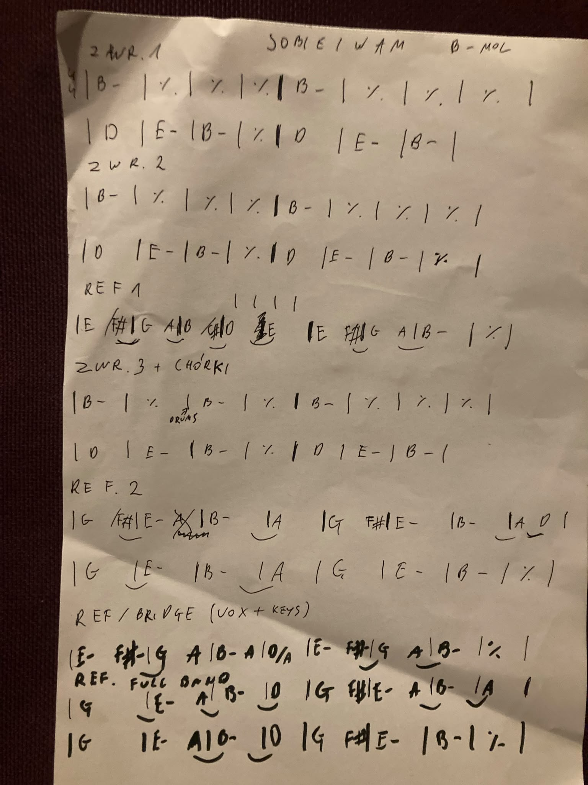

# Sobie i Wam
[**Return**](../) | [Chords](#chords) | [Lyrics](#lyrics) | [Legendary Pete Sheetz](#legendary-pete-sheetz)

| | |
|-|-|
| Title | Sobie i Wam |
| Artist | Męskie Granie |
| Writer | Katarzyna Nosowska, Marcin Macuk |
| Year | 2019 |
| Time signature | 4/4 |
| Tempo | 114 BPM |
| Key | Bm (original Am) |

### Sheet music

- [Nuty SAX](./sobieiwam-sax.pdf)
- [Nuty całość](./sobieiwam.pdf)

### Chords

```text
[Verse 1] 15 bars
| B- | % | % | % |
| B- | % | % | % |
| D | E- | B- | % |
| D | E- | B- |

[Verse 2] 16 bars
| B- | % | % | % |
| B- | % | % | % |
| D | E- | B- | % |
| D | E- | B- | % |

[Chorus 1]
| E- _ _ F#- | G _ _ A | B- _ _ C# | D _ E- _ |
| E- _ _ F#- | G _ _ A | B-        | %        |

[Verse 3] 15 bars
| B- | % | % | % |
| B- | % | % | % |
| D | E- | B- | % |
| D | E- | B- |

[Chorus 2]
| G _ _ F#- | E- | B- _ _ A | %       |
| G _ _ F#- | E- | B- _ _ A | A _ D _ |
| G _  _ E- | %  | B- _ _ A | %       |
| G _ _ F#- | E- | B-       | %       |

[Chorus 3] (piano + voc)
| E- _ _ F#- | G _ _ A | B- _ _ A | D/A |
| E- _ _ F#- | G _ _ A | B- | % |

[Chorus 4]
| G _ _ F#- | E- _ _ A | B- _ _ D | % |
| G _ _ F#- | E- _ _ A | B- _ _ A | % |
| G _ _ F#- | E- __ A | B- _ _ D | % |
| G _ _ F#- | E- | B- | % |

```

### Lyrics

```text
[V1] Za dużo roboty, a kołaczy brak
Za nisko ten sufit, żeby długi mógł stać
Zbyt kręta ta droga, by lekko ją przejść
Za suto na stole, żeby dało się zjeść

[V1] Za duże to ego, by dogadać się
Za mała ta chata, by kobietę mieć
Za jasny ten księżyc, by dało się spać
Za krótki ten łańcuch, by dać nogi za pas

[C] Życzymy sobie i wam, by nas było stać
Na święty spokój
Szczęścia ile się da, miłości w bród
Mądrych ludzi wokół

[V3] Za krótkie te nogi, by dogonić czas
(Za krótkie te nogi, by dogonić czas)
Za ciężka ta głowa, by pionowo stać
(Za ciężka ta głowa, by pionowo stać)
Zbyt mało tu miejsca, żeby rozgościć się
(Zbyt mało tu miejsca, żeby rozgościć się)
Za mało wszystkiego, co można by mieć

[Chorus] x5
```

### Legendary Pete Sheetz

